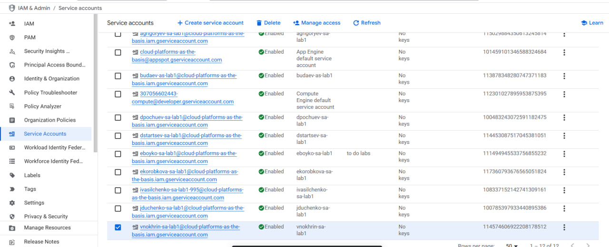
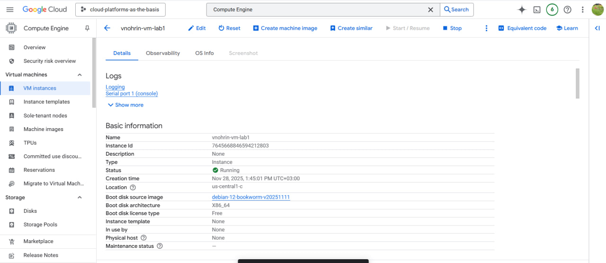
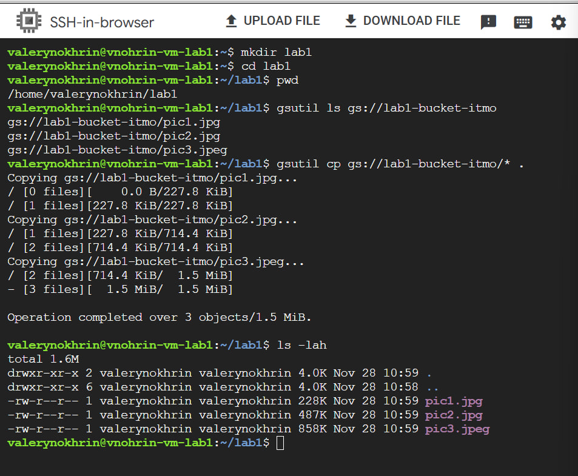
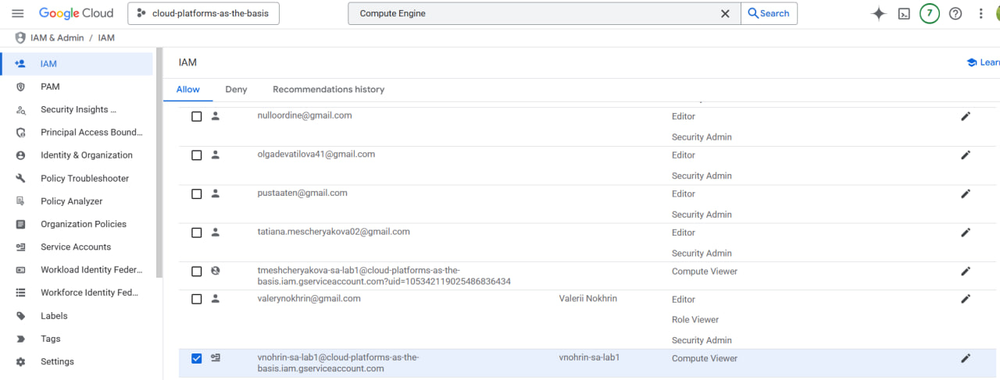
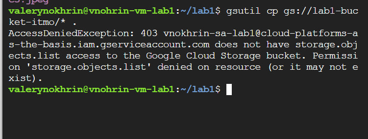

**Лабораторная работа №1 —Обзор Google Cloud и исследование основных сервисов**

Университет: Университет ИТМО
Факультет: ФТМИ
Дисциплина: Облачные платформы как основа технологического
Группа: U4225
Год: 2025/2026
Студент: Нохрин Валерий Витальевич
GitHub: valeriinohrin
Репозиторий: 2025-2026-cloud-platforms-u4225-nohrin_v_v
Дата начала: 28.11.2025
Дата завершения: 01.12.2025

**Тема: Обзор Google Cloud и исследование основных сервисов  
Цель: Изучить основные сервисы Google Cloud и базовые операции: создание VM, работа с хранилищем, управление правами.**

**Ход работы**

1. Получил доступ к Google Cloud после заполнения формы и открыл проект cloud-platforms-as-the-basis. Ознакомился с консолью и доступными сервисами.

2. Создал виртуальную машину vnohrin-vm-lab1 (e2-micro) в сервисе Compute Engine, указав зону us-central1-c и образ Debian.

3. Подключился к виртуальной машине по SSH, создал рабочую директорию lab1 и с помощью gsutil скопировал файлы из бакета lab1-bucket-itmo на VM. Проверил, что файлы pic1.jpg, pic2.jpg и pic3.jpeg появились в каталоге.

4. В разделе IAM изменил настройки сервисного аккаунта vnohrin-sa-lab1: вместо роли Storage Admin назначил более ограниченную роль Compute Viewer, чтобы проверить влияние прав доступа на работу с Cloud Storage.

5. Повторно выполнил команду gsutil cp для копирования файлов из бакета. В ответ получил ошибку AccessDeniedException 403, так как роль Compute Viewer не даёт прав на чтение объектов в бакете.

**Результаты** 
Создана виртуальная машина и настроен сервисный аккаунт.  
Сначала с ролью Storage Admin был получен доступ к Cloud Storage и выполнено копирование файлов на VM.  
После смены роли на Compute Viewer попытка повторного копирования завершилась ошибкой доступа, что показало влияние IAM-ролей на возможность работы с объектами в бакете.  
Все задания лабораторной работы выполнены.

**Вывод**  
Google Cloud предоставляет удобные средства для создания и управления ресурсами: виртуальными машинами, сервисными аккаунтами и хранилищами данных. В ходе работы на практике показано, что корректная настройка ролей IAM критически важна для безопасности и работы приложения: при широких правах (Storage Admin) операции с бакетом проходят успешно, а при ограниченной роли (Compute Viewer) доступ к объектам хранилища блокируется. Лабораторная работа позволила получить базовый практический опыт взаимодействия между Compute Engine и Cloud Storage.
