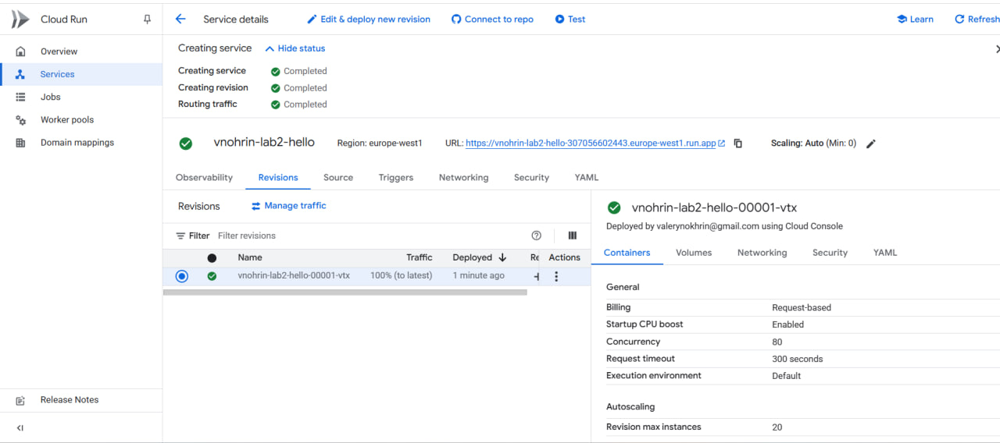
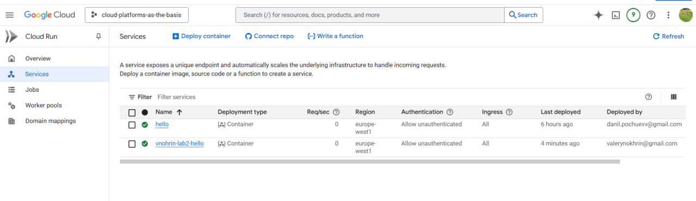
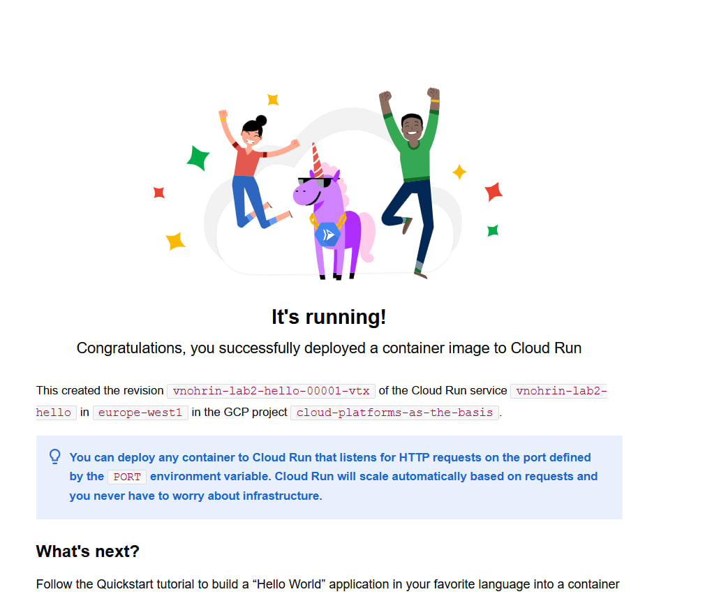
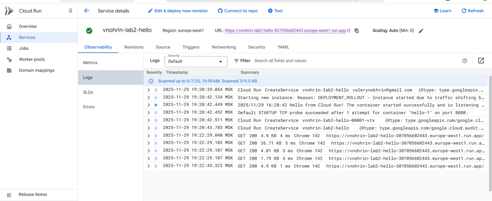
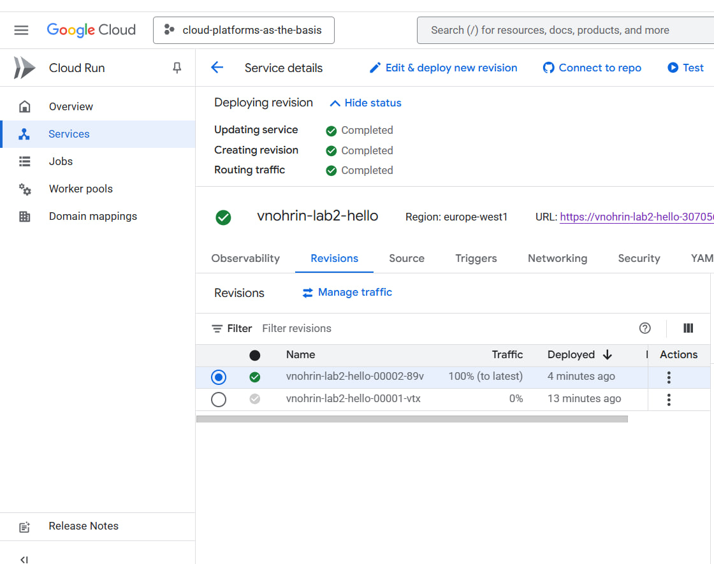

**Лабораторная работа №2 — Исследование Cloud Run**

Университет: Университет ИТМО Факультет: ФТМИ Дисциплина: Облачные платформы как основа технологического Группа: U4225 Год: 2025/2026 Студент: Нохрин Валерий Витальевич GitHub: valeriinohrin Репозиторий: 2025-2026-cloud-platforms-u4225-nohrin_v_v Дата начала: 29.11.2025 Дата завершения: 01.12.2025

**Цель работы: Ознакомиться с работой Cloud Run**

**Ход работы**  
### 1. Список сервисов Cloud Run
В консоли создал сервис vnohrin-lab2-hello. На скрине видно, что оба сервиса работают, аутентификация открытая.

### 2. Первая ревизия сервиса
Перешёл внутрь сервиса. Видна ревизия 00001-vtx, трафик направлен на неё, деплой прошёл успешно.

### 3. Проверка работы по внешнему URL
Открыл URL — Cloud Run отвечает стандартной страницей “It’s running!”. Контейнер запускается.

### 4. Логи сервиса
Посмотрел логи. В логах видно успешный запуск контейнера и несколько запросов GET 200.

### 5. Новая ревизия и переключение трафика
Создал новую ревизию. Теперь трафик идёт на 00002/00003, предыдущая ревизия отключена. Всё обновилось без ошибок.

**Результаты работы**  
В ходе выполнения лабораторной работы был развернут сервис Cloud Run, создана ревизия, проверена маршрутизация трафика и работа контейнера. Логи подтвердили успешную обработку запросов.

**Вывод**  
В результате лабораторной работы было изучено развертывание контейнерных приложений в Cloud Run. Выполнено создание сервиса, проверена работа ревизий, проанализированы журналы запросов. Cloud Run обеспечивает удобное автоматическое масштабирование и простое управление сервисами без настройки серверов.
